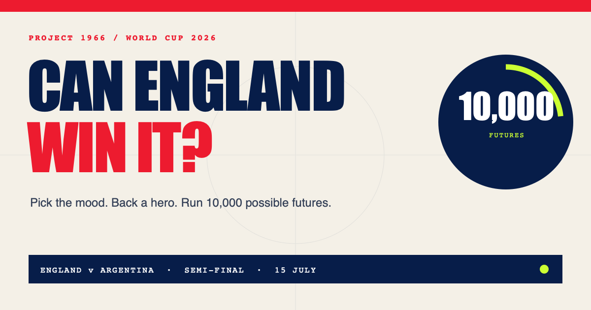

# Can England Win It?

An interactive, explainable World Cup probability game. Make three matchday calls, pick an England hero and watch 10,000 simulations of the 2026 semi-finals and final play out.

**[Try the live simulator](https://matthewpaver.github.io/can-england-win-it/)**



## Why this exists

England reached the 2026 World Cup semi-final after beating Norway 2–1 after extra time. This project turns the question everyone is asking into something people can explore, challenge and share.

It is deliberately transparent: no black-box prediction, betting odds or invented certainty. Matchday mode keeps it playful; analyst mode exposes every assumption.

## Features

- Simple three-step matchday mode
- Player wildcard cards for Bellingham, Kane, Saka and Pickford
- Full-screen animated tournament sequence
- 10,000 seeded Monte Carlo tournament simulations
- Elo-inspired matchup probabilities
- Optional analyst mode with four performance controls
- Automatic or forced France/Spain final matchup
- Shareable scenarios encoded in the URL
- Central estimate plus an honest illustrative model range
- Animated probability dial and outcome distribution
- Current tournament route and match countdown
- Responsive, keyboard-friendly interface
- Unit-tested simulation engine
- Automated GitHub Pages deployment

## How the model works

Each team starts with an illustrative strength rating. England's rating is adjusted using the user's matchday choices. The selected player adds a clearly labelled entertainment boost rather than a claimed statistical player value. For every simulated tournament:

1. France plays Spain.
2. England plays Argentina.
3. If England advance, they play the simulated finalist.
4. The aggregate of 10,000 runs becomes the displayed probability.

Match probabilities use an Elo-style logistic curve:

```text
P(win) = 1 / (1 + 10 ^ ((opponentRating - teamRating) / 330))
```

This is a scenario tool—not a forecast or betting product. The ratings are intentionally isolated in `src/model.ts` so a future data source can replace them cleanly.

## Run locally

```bash
npm install
npm run dev
```

Then open `http://localhost:5173/can-england-win-it/`.

## Test and build

```bash
npm test
npm run build
```

## Stack

React 19 · TypeScript · Vite · Vitest · CSS · GitHub Pages

## Data and attribution

Tournament state and match results were checked against [FIFA's 2026 World Cup coverage](https://www.fifa.com/en/tournaments/mens/worldcup/canadamexicousa2026/). Player names and squad numbers were checked against [England Football's official squad list](https://www.englandfootball.com/articles/2026/Jun/02/england-men-fifa-world-cup-2026-squad-numbers-revealed-20260206). The player cards and team marks are original CSS illustrations; no official logos or player photography are used.

This is an independent, unofficial data experiment and is not affiliated with FIFA or The FA.

## License

MIT © Matthew Paver
